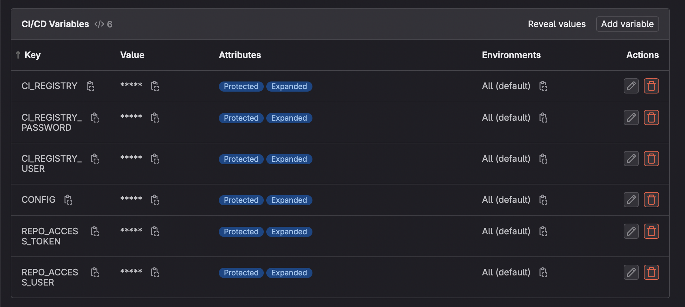
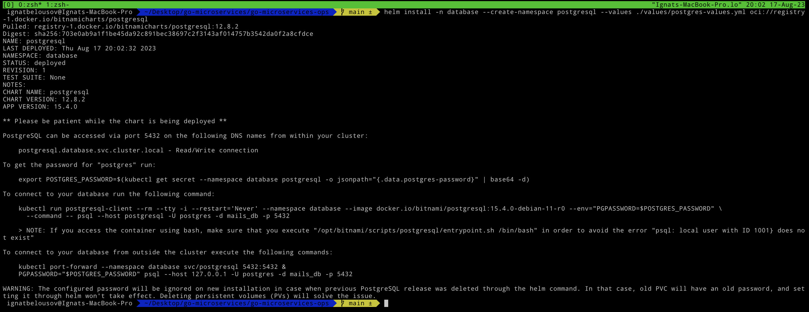
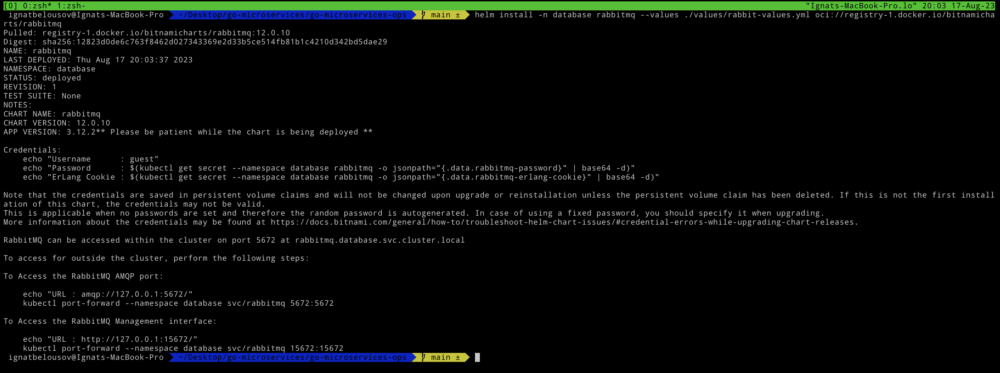
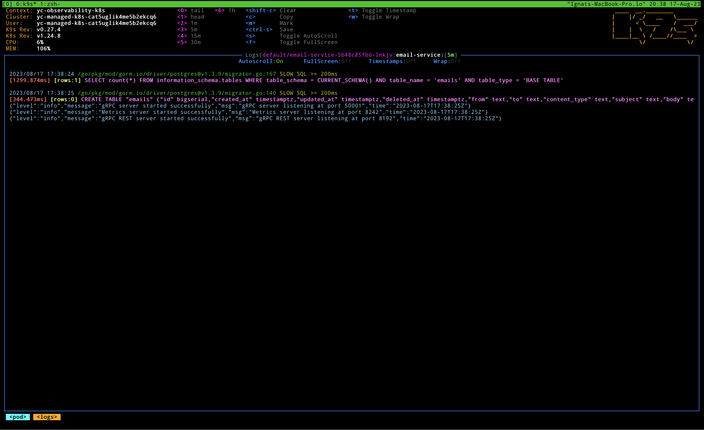
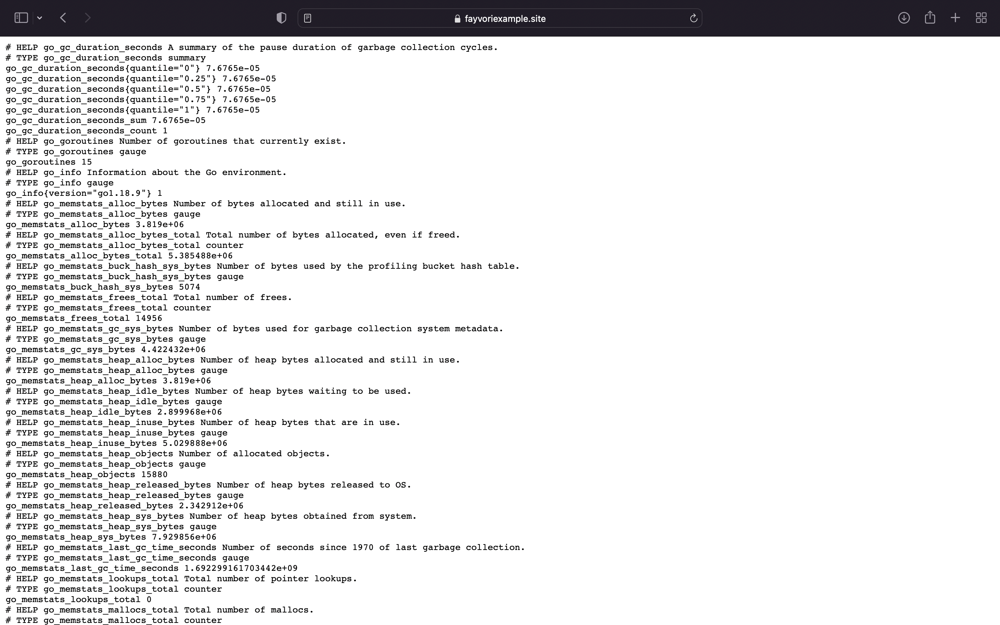

<div align="center">
<h1>Go-Microservices-Ops</h1>
<p>
Ops repository for <a href="https://github.com/fayvori/golang-email-microservice">golang-email-microservice</a>
</p>
</div>

# Requirments

- Kubernetes cluster
- kubectl
- helm
- Yandex Cloud
- Yandex Cloud CLI
- Elastic Cloud
- Terraform
- GitLab account & runner

# Implementation

### GitLab Part

You need to setup some `CI/CD` variables in `dev repository` in order for pipeline to work.



- **CI_REGISTRY** - your private or public docker registry, if you wanna use `docker-hub` set it to `docker.io`
- **CI_REGISTRY_PASSWORD** - password for registry
- **CI_REGISTRY_USER** - username for registry
- **CONFIG** - a config which will be used in `test` step, you can find example config [here]()
- **REPO_ACCESS_TOKEN** - token which will be used to access private GitLab repository without ssh auth, you can create this token by following this instructions: ***YOUR_GITLAB_REPO > Settings > Access Tokens > Add new token***
- **REPO_ACCESS_USER** - gitlab username

Also create GitLab runner and register it for dev repository. You can find guide for it [here](https://github.com/fayvori/iac-gitlab-runner)

The pipeline will work as follows:

1. Code lint
2. Test code 
3. Build docker image (depends on branch) and push it to the docker registry
4. If branch is `main` my custom tool `helm-tag-updater` updates tag of `values.yaml` file in this repository for `ArgoCD`

### Note

In order this example to work you need `kubernetes` cluster up and running. In order to create it go to the terraform folder and apply all the files

```bash
terraform init 
terraform apply
```

For obtaining yandex kubernetes config execute the following command

```bash
yc managed-kubernetes cluster get-credentials observability-k8s --external
```

### Kubernetes Part

- For setting up `monitoring stack` refer this [guide](https://github.com/fayvori/observability-k8s#kube-prometheus-stack)
- For `EFK` setup refer this [guide](https://github.com/fayvori/observability-k8s#efk-stack)
- For `jaeger` setup refer this [guide](https://github.com/fayvori/observability-k8s#jaeger)
- For `ingress-controller` setup refer this [guide](https://github.com/fayvori/traefik-cert-manager)
<!-- - For `vault-operator` setup refer this [repo](https://github.com/sagikazarmark/demo-bank-vaults-secret-injection) -->

I assume at this point you already have all the requirments up and running in your cluster. Now we can start deploying `email-service` inside k8s envirement (***NOTE: for show case purposes I'm deploying database and rabbitmq inside kubernetes cluster in order to make this setup simple***)

Now deploy `rabbitmq` and `postgresql` using the following helm charts. (*NOTE: you can find helm values in `values` folder*)

- [PostgeSQL](https://artifacthub.io/packages/helm/bitnami/postgresql)
- [RabbitMQ](https://artifacthub.io/packages/helm/bitnami/rabbitmq)

```bash
helm install -n database --create-namespace postgresql --values ./values/postgres-values.yml oci://registry-1.docker.io/bitnamicharts/postgresql
```



```bash
helm install -n database rabbitmq --values ./values/rabbit-values.yml oci://registry-1.docker.io/bitnamicharts/rabbitmq
```



Edit the config file inside `email-service/example` and deploy `email-service` to the kubernetes.

```yaml
smtp:
  Host: ""
  Port: 0
  User: ""
  Password: ""

logger:
  Mode: "prod"

metrics:
  Port: 8242

gateway:
  Port: 8192

jaeger:
  Host: "jaeger-agent.monitoring.svc.cluster.local"

grpc:
  Port: 50001

rabbit:
  Host: "rabbitmq.database.svc.cluster.local"
  Port: 5672
  User: "guest"
  Password: "guest"
  QueueName: "emails"
  ConsumePool: 2

database:
  Host: "postgresql.database.svc.cluster.local"
  Port: 5432
  User: "postgres"
  Password: "postgres"
  DbName: "mails_db"
  SslMode: "disable"

```

Now install it using helm 

```bash
helm install email-service ./email-service
```

Let's check `email-service` logs



As we can see app connected successfully to rabbitmq and postgres and now up and running

For example let's check out metrics in browser on root path



That's all. For more info about endpoints and documentation refer to dev repo.

# License 

```
MIT License

Copyright (c) 2023 Ignat Belousov

Permission is hereby granted, free of charge, to any person obtaining a copy
of this software and associated documentation files (the "Software"), to deal
in the Software without restriction, including without limitation the rights
to use, copy, modify, merge, publish, distribute, sublicense, and/or sell
copies of the Software, and to permit persons to whom the Software is
furnished to do so, subject to the following conditions:

The above copyright notice and this permission notice shall be included in all
copies or substantial portions of the Software.

THE SOFTWARE IS PROVIDED "AS IS", WITHOUT WARRANTY OF ANY KIND, EXPRESS OR
IMPLIED, INCLUDING BUT NOT LIMITED TO THE WARRANTIES OF MERCHANTABILITY,
FITNESS FOR A PARTICULAR PURPOSE AND NONINFRINGEMENT. IN NO EVENT SHALL THE
AUTHORS OR COPYRIGHT HOLDERS BE LIABLE FOR ANY CLAIM, DAMAGES OR OTHER
LIABILITY, WHETHER IN AN ACTION OF CONTRACT, TORT OR OTHERWISE, ARISING FROM,
OUT OF OR IN CONNECTION WITH THE SOFTWARE OR THE USE OR OTHER DEALINGS IN THE
SOFTWARE.
```